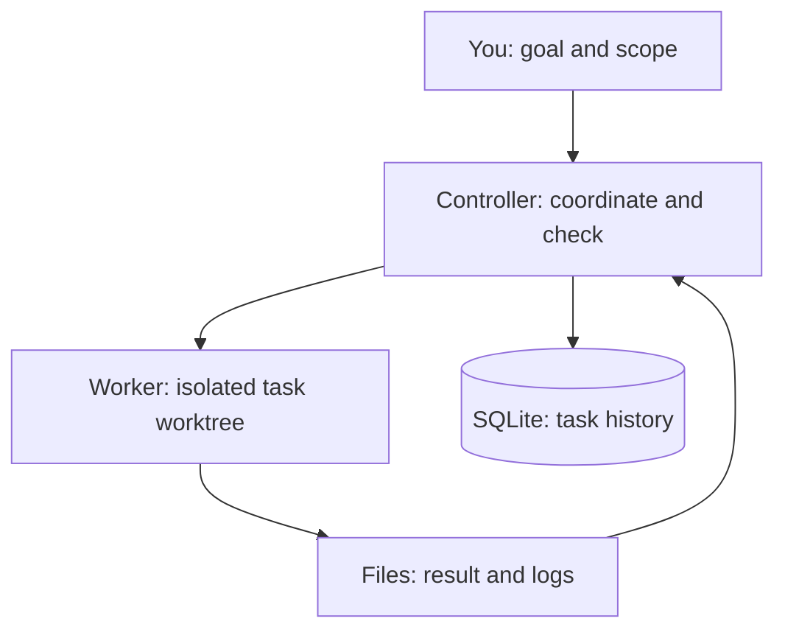

# MABS — Multi-Agent Build System

**Turn scoped tasks into local, checked Git changes using your Claude or Codex subscription.**

MABS coordinates coding workers, runs your repository's checks, and keeps a record of what happened. You define the goal and acceptance criteria; the controller manages the queue, isolated task branches, repairs, and review.

[Get started](docs/getting-started.md) · [Visual guide](docs/architecture/index.md) · [Documentation](docs/index.md)

## Why use it?

- **Keep work separate.** Each task runs in its own Git worktree—a separate checkout with its own branch.
- **Check more than the model's answer.** Run repository checks and apply the project's review policy before marking work done.
- **Understand failures.** Inspect attempts, logs, review findings, and the reason a task is blocked.
- **Continue after an interruption.** A restarted controller reconciles recorded workers rather than blindly starting them again.
- **Coordinate multiple projects.** Bound concurrency by project and provider; keep paused projects without running workers.

## Is MABS for you?

A good fit if you already use Git and a supported subscription CLI, want repeatable local workflows, and are comfortable inspecting diffs and test results.

It is **not** a hosted coding service, a security sandbox for untrusted repositories, or an automatic production deployment system. Workers and repository checks execute local commands: use trusted repositories and inspect the results.

## Architecture



**In words:** you submit a task through the CLI or Pi. The controller launches a worker in a separate checkout, collects its result, runs checks and any required review, and records the outcome. The workbench lets you inspect the records and evidence. The controller does not merge or publish the result.

This is a simplified responsibility map—not the full lifecycle. Choose a focused view:

| Question | Guide |
| --- | --- |
| What are the main parts? | [System overview](docs/architecture/system-overview.md) |
| How does a task get done? | [Task execution](docs/architecture/task-execution.md) |
| What happens when something fails? | [Recovery and failures](docs/architecture/recovery-and-failures.md) |
| What does an approval permit? | [Approvals and configuration](docs/architecture/approvals-and-config.md) |

## Start here

You need **Node.js 24+**, **Git**, and an authenticated **Claude Code or Codex CLI** for model tasks. Python and JavaScript/TypeScript project profiles can discover supported checks; your target project's tools must also be installed.

```bash
git clone https://github.com/prathyushreddy123/multi-agent-build-system.git
cd multi-agent-build-system
# The extension features documented here are on this branch.
git switch mabs-extension
npm ci
npm test
npm run typecheck
node src/cli.ts help
```

These steps install and check MABS; they do not start coding workers. Follow the **[getting-started guide](docs/getting-started.md)** to register a repository and run a small first task.

## What stays under your control

- **Local state:** SQLite stores task history; files store logs and other evidence.
- **Subscription access:** supported workers use Claude/ChatGPT sessions. Paid model API fallback is prohibited; subscription limits still apply.
- **Quality policy:** checks and review coverage are explicit. Missing checks are not proof of success.
- **Publication:** the controller does not push, merge, or release changes. Deployment has a tested adapter boundary, but no production adapter or CLI execution command.
- **Optional operations:** CI, deployment, monitoring, delivery, and related settings start disabled/manual. Preparing an operation does not execute it.

## Explore further

- [FAQ](docs/faq.md): subscriptions, supported projects, safety, and starting from an idea.
- [Troubleshooting](docs/troubleshooting.md) and [command reference](docs/commands.md): practical help when work stops.
- [Documentation hub](docs/index.md): choose a guide by what you want to do.
- [Local workbench](docs/getting-started.md#4-start-the-controller): inspect tasks, checks, reviews, and evidence at `http://127.0.0.1:4317` while the UI is running.
- [Configuration curator](docs/curator.md) and [routing policy](docs/routing-policy-v1.md): advanced configuration.
- [Implementation history](docs/index.md#history-and-design-decisions): earlier phase summaries and verification evidence, separate from current usage instructions.

Want to help? [Contribute a focused fix, test, or documentation improvement](CONTRIBUTING.md).

For the full CLI command list, run `node src/cli.ts help`.
