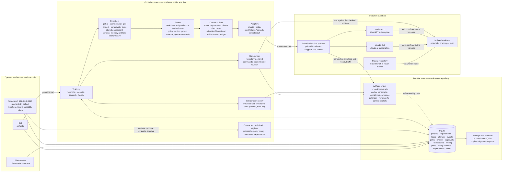
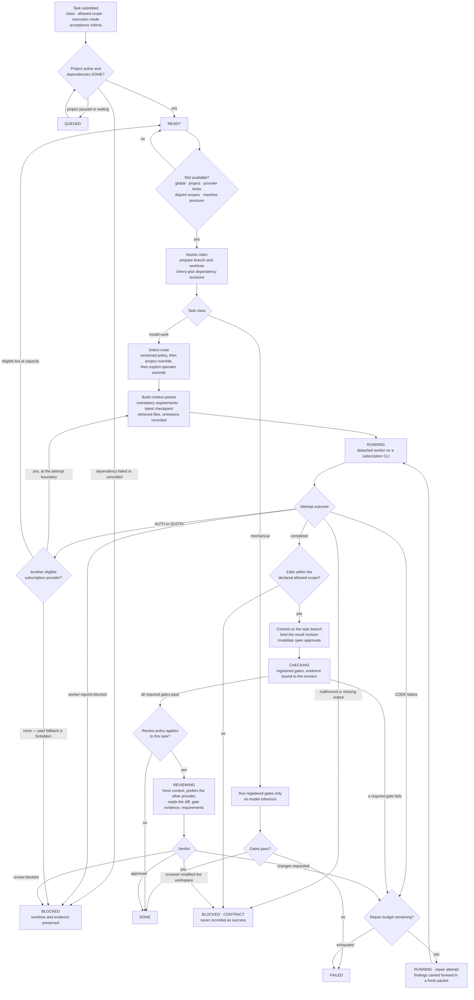
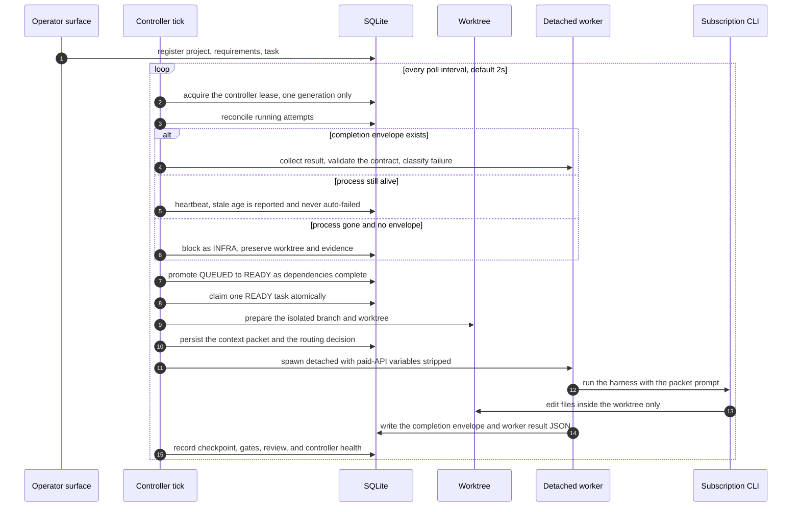
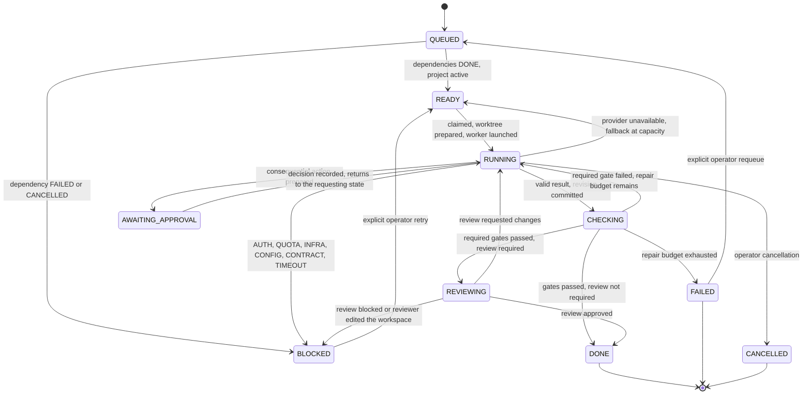
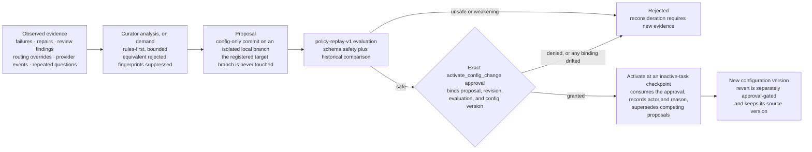

# MABS

A local multi-agent build system with an LLM-assisted orchestrator and a deterministic, SQLite-backed task controller. It uses existing Claude Pro and ChatGPT subscription sessions and strips API-key paths before launching workers.

## Current status

Phases 0–5 are complete, along with the source plan's pre-routine-use acceptance checklist (stale-heartbeat visibility, many inactive projects alongside active ones, and database/lease-error visibility). No further numbered phases are defined in the plan. The system now includes durable projects/tasks/attempts/events, isolated Git worktrees, portable context packets with deterministic relevant-file retrieval and bounded context budgets, Claude and Codex subscription adapters, deterministic quality gates, bounded implementation/review feedback loops, revision-bound approvals, crash recovery, multi-project scheduling, provider-aware routing with outcome telemetry, persisted execution plans, structured task checkpoints and cross-provider continuity, evidence/context diagnostics, durable user feedback, an approval-gated configuration curator, a measured optimization-experiment registry, and a localhost workbench.

See [`docs/implementation-status.md`](docs/implementation-status.md), the [configuration curator guide](docs/curator.md), the [versioned routing policy](docs/routing-policy-v1.md), and the source plan in [`docs/requirements/source-plan.txt`](docs/requirements/source-plan.txt).

## Architecture

MABS splits the system along one line: a **deterministic controller** owns scheduling, state, quality gates, and evidence, while **non-deterministic workers** only ever run inside an isolated Git worktree behind a strict output contract. SQLite is the authoritative record, large artifacts are files on disk referenced by path, and the controller itself never pushes, merges, releases, or deploys.

### System map



### Task execution flow

This is the path every task takes. Each decision below is enforced in code, not by prompt instruction.



### One controller tick and the worker handoff



A worker deliberately outlives its controller. Because the completion envelope is a file and the attempt is a durable record, a restarted controller collects the same launch instead of dispatching a duplicate; a `RUNNING` task with no live attempt fails closed to `BLOCKED` rather than being retried silently.

### Task lifecycle



Cancellation is available from every non-terminal state and terminates the worker process group; only `RUNNING`, `CHECKING`, and `REVIEWING` hold a worker slot. The authoritative transition matrix is [`src/domain/states.ts`](src/domain/states.ts).

### Failure classification

Repair cycles are a budget for the model's own mistakes, so only `CODE` spends one. This is what keeps a session limit or a bad model name from silently consuming the budget that real code repair needs.

| Class | Repair budget | Controller response |
| --- | --- | --- |
| `CODE` | spent | Repair attempt carrying the findings; `FAILED` once the limit is reached. |
| `QUOTA` | untouched | Persisted provider cooldown, reroute at the attempt boundary, `READY` if the fallback is at capacity, `BLOCKED` if there is none. |
| `AUTH` | untouched | Provider unavailable until `provider reset`; reroute to an eligible subscription provider if one exists. |
| `CONFIG` | untouched | `BLOCKED`. An unroutable model, rejected flag, or missing tool cannot be fixed by retrying. |
| `CONTRACT` | untouched | `BLOCKED`. Malformed output, or edits outside the declared scope, are never success. |
| `INFRA` | untouched | `BLOCKED` with the worktree and evidence preserved for inspection. |
| `TIMEOUT` | untouched | `BLOCKED`. |
| `CANCELLED` | n/a | `CANCELLED`; the worker process group is terminated. |

No failure path ever falls back to a paid API route. Forbidden key/base-URL variables are removed from the worker environment and the launch refuses to start if any survive.

### Approval and configuration boundary



The same shape governs every consequential action. An approval is a durable authorization record bound to an exact action, target, revision, and configuration — not an executor. Push, merge, release, and deployment executors do not exist in this codebase, and any drift in a binding invalidates the open approval rather than widening it.

## Requirements

- Node.js 24+
- Git
- At least one authenticated subscription CLI:
  - `claude auth status` using `claude.ai`
  - `codex login status` using ChatGPT

No API key is required or permitted for worker launches.

## Setup

```bash
npm install
npm test
npm run typecheck
node src/cli.ts verify --quick
```

## Basic workflow

```bash
# Register a repository. Existing npm/pytest checks are proposed automatically.
node src/cli.ts project add demo /path/to/repo --goal="Deliver the next milestone"

# Add stable project requirements and a task.
node src/cli.ts requirement add demo REQ-1 "All existing tests must continue to pass"
node src/cli.ts task add demo "Implement feature" \
  --objective="Implement the accepted feature scope" \
  --accept="registered checks pass;result is committed locally" \
  --class=small_implementation --scope=src,test \
  --mode=single --mode-reason="One bounded implementation task."

# Run the controller and local workbench.
node src/cli.ts controller run --adapter=codex --ui
```

The default workbench is `http://127.0.0.1:4317`. Runtime state defaults to `~/.local/state/mabs`; worktrees default to `~/worktrees`. Override these with `MABS_STATE_DIR`, `MABS_DB_PATH`, and `MABS_WORKTREE_ROOT`.

When this repository is trusted by Pi, `.pi/extensions/mabs.ts` adds `/mabs-status`, `/mabs-project`, `/mabs-task`, `/mabs-plan`, `/mabs-feedback`, `/mabs-approval`, `/mabs-curate`, `/mabs-provider`, `/mabs-start`, `/mabs-ui`, and `/mabs-backup`, plus read-status and submit-task tools.

## Useful commands

```bash
node src/cli.ts help
node src/cli.ts status
node src/cli.ts task list
node src/cli.ts plan validate plan.json
node src/cli.ts plan apply demo plan.json
node src/cli.ts plan list --project=<id>
node src/cli.ts feedback add task <id> question --body="..." --version=<recordVersion>
node src/cli.ts approval request <task> deploy <target> --reason="..."
node src/cli.ts curator snapshot demo > config.json
node src/cli.ts curator suggest demo --title="Rules-first suggestion"
node src/cli.ts curator propose demo config.json --title="..." --rationale="..."
node src/cli.ts curator evaluate <proposal>
node src/cli.ts curator history demo
node src/cli.ts optimization create demo experiment.json
node src/cli.ts optimization record <experiment> baseline case-1 measurement.json
node src/cli.ts optimization complete <experiment>
node src/cli.ts optimization routing demo
node src/cli.ts provider list
node src/cli.ts provider reset codex
node src/cli.ts controller once --workers=2 --codex-limit=1 --claude-limit=1
node src/cli.ts baseline --only=complex --harness=codex
node src/cli.ts maintenance policy
node src/cli.ts maintenance backup
node src/cli.ts maintenance prune          # dry-run
node src/cli.ts maintenance prune --apply  # explicit deletion
```

SQLite records and completed summaries are retained indefinitely. Full artifacts are retained for 30 days after successful tasks and 90 days after failed or cancelled tasks; active and blocked task evidence is not automatically eligible. Pruning is dry-run unless `--apply` is supplied. The newest 14 consistent SQLite backups are retained.

Routing is task-class based and evidence-informed. Supplying `--adapter=codex|claude` is an explicit operator override; omitting it uses the versioned policy. `--workers`, `--active-projects`, `--per-project-workers`, `--codex-limit`, and `--claude-limit` control concurrency. Optional `--min-free-memory-mb` and `--max-load-per-cpu` thresholds pause new dispatch under machine pressure. Quota failures enter a persisted cooldown and may reroute only at an attempt boundary; authentication failures remain unavailable until `provider reset`.

New CLI-onboarded projects default to substantive independent review after revision-bound quality gates. Review uses a fresh context, prefers a provider different from the implementer when eligible, records structured findings, and can return bounded repairs for re-check and re-review.

The Phase 4 curator writes proposed configuration to an isolated local Git branch, runs deterministic policy replay, and requires an exact `activate_config_change` approval before changing active local configuration. Activation and revert history are durable, and equivalent rejected suggestions require new evidence before reconsideration.

Phase 5 replaces the previously empty context relevant-file manifest with deterministic, rules-first retrieval bounded by a per-project token budget; every included or omitted file is recorded with a reason. Durable checkpoints let a rerouted attempt build a fresh context packet for the new provider instead of relying on another provider's history. Improvement or limitation-resolution claims require a completed optimization experiment comparing a fixed baseline and candidate suite; regressions in accepted work, requirement violations, or interventions are rejected.

Consequential actions such as push, merge, and deploy are not performed by the controller. The workbench and CLI can prepare and decide exact revision/configuration-bound approvals, but no approval is itself an external-action executor. Target, revision, or project-configuration drift invalidates open approvals.
