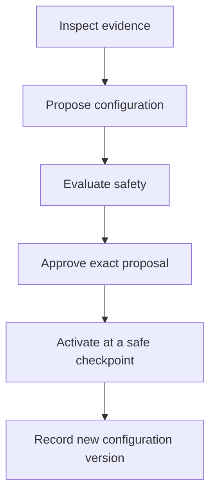

# Approvals and configuration

[Visual guide](index.md) · Previous: [Recovery and failures](recovery-and-failures.md) · [State reference](state-reference.md)

**An approval authorizes one exact action. It is not an executor.** A changed target, revision, or configuration can make an earlier approval invalid.

## Example: activate a configuration proposal

**In words:** the curator uses observed evidence to suggest a configuration change. A proposal is a complete snapshot committed on an isolated local branch. Evaluation checks safety before approval is requested. An approved, still-current proposal can activate when the project has no task in `RUNNING`, `CHECKING`, or `REVIEWING`. Activation consumes the approval and records who changed what and why.

This is the successful path. Unsafe proposals, denied approval, changed bindings, or active tasks prevent activation. The diagram does not imply that every proposal will be approved.

## What must still match?

| Binding | Why it matters |
| --- | --- |
| Proposal and Git revision | Approval covers the exact proposed content, not a later edit. |
| Evaluation evidence | The approved proposal must have passed the required evaluation. |
| Current configuration | A decision made against an older configuration cannot silently apply to a newer one. |
| Action and target | Permission for one action or destination is not permission for another. |

A revert also needs its own approval. It creates a new version containing a historical configuration; it does not erase history.

## What approvals do not mean

- **Push, merge, and release:** the controller has no executors for these actions.
- **Deployment:** an internal adapter boundary has simulated failure/recovery tests, but no production adapter or CLI/Pi execution command is registered.
- **Optional operations:** preparation is a dry run. Disabled/manual defaults are not active automation.
- **Quality claims:** configuration safety replay is not proof that a candidate produces better code or reduces subscription spending. Improvement claims need a completed, measured comparison.

For the operational commands, use the [curator guide](../curator.md). For implementation details, see [approval and activation records](../../src/store/records.ts), [curator service](../../src/curator/service.ts), and [optional operations](../../src/operations/service.ts).
