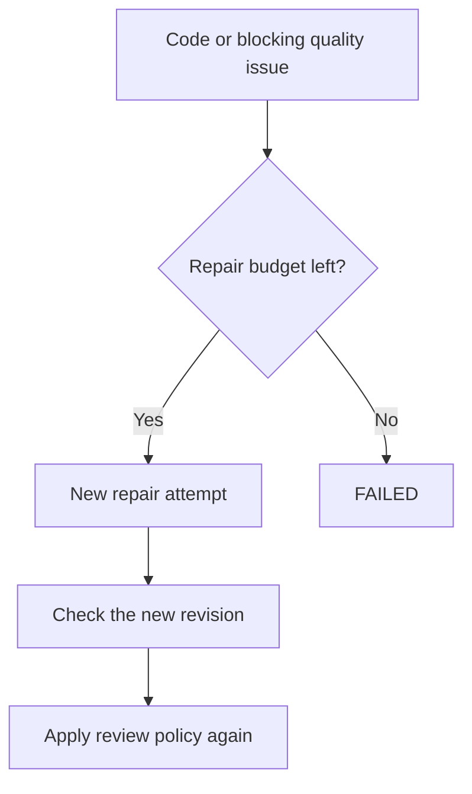
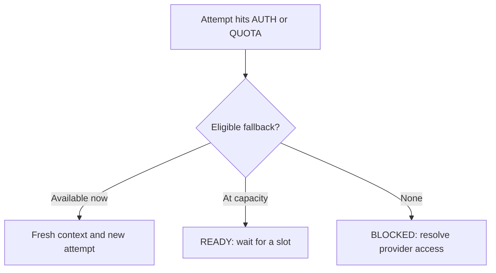
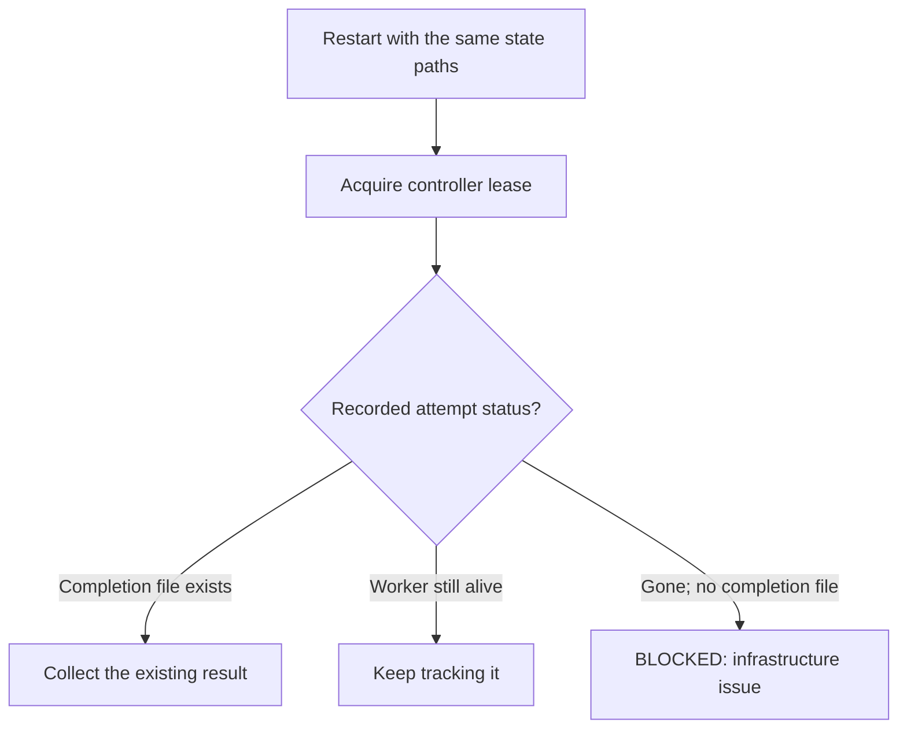

# Recovery and failures

[Visual guide](index.md) · Previous: [Task execution](task-execution.md) · Next: [Approvals and configuration](approvals-and-config.md)

**Read the recorded reason before retrying.** Code problems, provider limits, and missing infrastructure need different responses.

## Repair after a failed check or review

**In words:** a worker code failure, required check failure, or blocking review finding may start a repair. Findings go into fresh context; the new revision is checked and reviewed as needed. Further failures repeat the bounded process. Only code-repair cycles consume this budget; auth and quota failures do not. The default repair limit is two.

## Provider fallback during implementation

**In words:** fallback happens between attempts, not halfway through an active worker. MABS records the provider problem and looks for another eligible subscription route. The replacement receives a fresh packet built from durable checkpoints. The repair counter is unchanged. There is no paid-API escape route.

`QUOTA` records a cooldown; `AUTH` leaves the provider unavailable until an explicit reset after login is fixed. Review-provider failures have their own handling; this diagram describes implementation fallback, not every review transition.

## Controller restart

**In words:** a worker can outlive the controller. A restarted controller checks the recorded launch before doing anything new. It collects the existing result, continues tracking the worker, or blocks with evidence. It does not blindly launch a replacement.

A stale heartbeat is a reason to investigate, not automatic proof of failure. A task recorded as running without a live attempt also blocks rather than silently restarting. Keep the worktree and evidence when investigating.

## Failure reference

| Class | Uses code-repair budget? | Typical response |
| --- | --- | --- |
| `CODE` | Yes, when a repair is launched | Carry findings into a repair; fail when the budget is exhausted. |
| `QUOTA` | No | Record cooldown; use eligible fallback, wait for capacity, or block. |
| `AUTH` | No | Mark provider unavailable; fix login before resetting provider state. |
| `CONFIG` | No | Fix a missing tool, unsupported model/flag, or invalid configuration. |
| `CONTRACT` | No | Inspect malformed results, out-of-scope edits, or reviewer workspace changes. Never count them as success. |
| `INFRA` | No | Preserve and inspect the worktree, process state, and evidence. |
| `TIMEOUT` | No | Investigate the timeout before retrying. |
| `CANCELLED` | Not applicable | Explicit task cancellation stops its worker process group. |

## Waiting for review is not passing review

When policy requires a review and capacity is unavailable, MABS records the missing review. Under the pending-capacity policy, the task is `BLOCKED` with a review-pending reason and can return directly to `REVIEWING` when capacity becomes available. Other review blockers require intervention. Neither case should be described as completed review.

**Sources:** [Controller recovery, repair, and fallback](../../src/controller/controller.ts) · [Failure classes](../../src/core/failure.ts) · [Complete state reference](state-reference.md)
