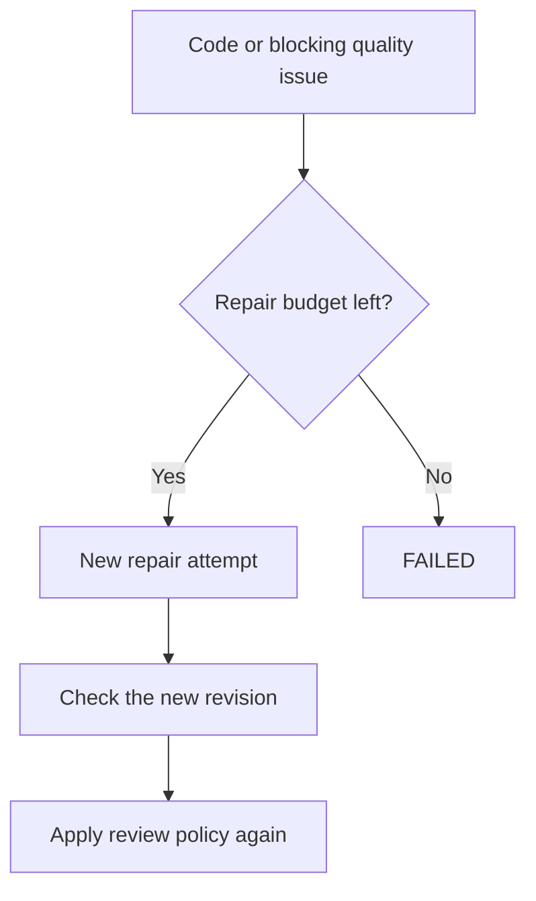
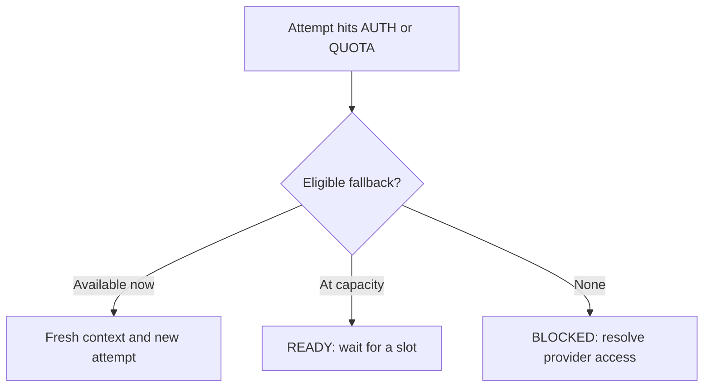
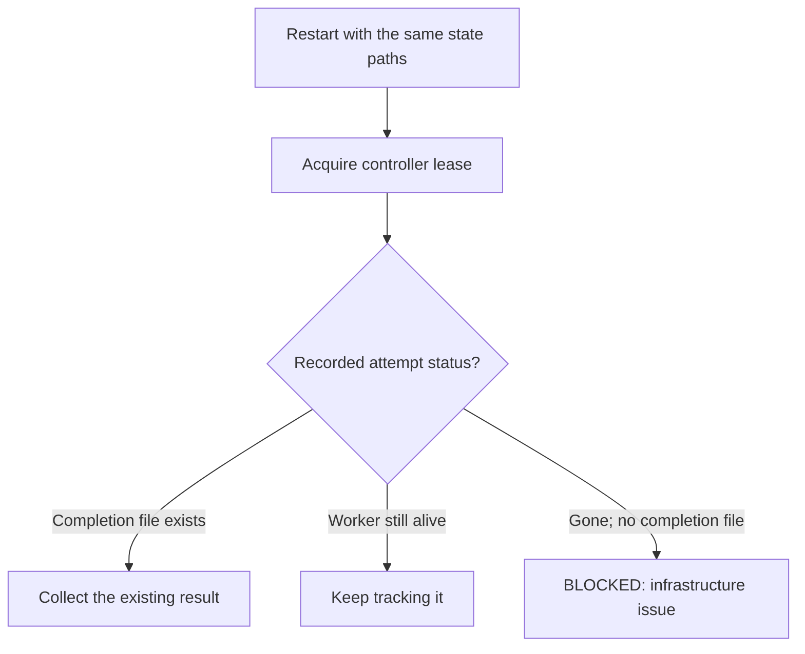

# Recovery and failures

[Visual guide](index.md) · Previous: [Task execution](task-execution.md) · Next: [Approvals and configuration](approvals-and-config.md)

**Read the recorded reason before retrying.** Code problems, provider limits, and missing infrastructure need different responses.

## Repair after a failed check or review

```mermaid
flowchart TB
    ISSUE["Code or blocking quality issue"] --> B{"Repair budget left?"}
    B -->|"Yes"| R["New repair attempt"]
    R --> C["Check the new revision"]
    C --> NEXT["Apply review policy again"]
    B -->|"No"| F["FAILED"]
```

**In words:** a worker code failure, required check failure, or blocking review finding may start a repair. The new revision is checked and reviewed as needed. Further failures repeat the bounded process. Only code-repair cycles consume this budget; auth and quota failures do not. The default repair limit is two (`task add --repair-limit=N` changes it).

**Repairs continue the implementer's session when they can.** A repair on the same provider, model, and effort resumes that session with a short brief listing the open obligations by ID, any further findings, the check instruction, and the exit condition. This requires the session to be under an hour old and the worktree to still be at that attempt's committed result. Otherwise, or if the resume fails before any model output, the repair runs cold from the full packet. Attempts record `parentAttemptId` and `parentSessionId`.

**Identical failures do not loop.** Before a model launch, the controller compares the last two non-review attempts. If both failed on the same route with the same normalized failure, and the next launch would use that route again, the third launch is refused and the task blocks with the symptom. Provider outages are excluded because they reroute. An explicit `task retry` after the second failure always gets its launch.

## Provider fallback during implementation

```mermaid
flowchart TB
    P["Attempt hits AUTH or QUOTA"] --> E{"Eligible fallback?"}
    E -->|"Available now"| N["Fresh context and new attempt"]
    E -->|"At capacity"| R["READY: wait for a slot"]
    E -->|"None"| B["BLOCKED: resolve provider access"]
```

**In words:** fallback happens between attempts, not halfway through an active worker. MABS records the provider problem and looks for another eligible subscription route. The replacement receives a fresh packet built from durable checkpoints. The repair counter is unchanged. There is no paid-API escape route.

`QUOTA` records a cooldown; `AUTH` leaves the provider unavailable until an explicit reset after login is fixed. Claude's subscription-window messages ("You've hit your session/weekly/daily/usage limit · resets …") count as `QUOTA`, so the provider cools down and the work waits instead of blocking as infrastructure. Models that share one subscription share its quota domain, so a fallback never retries another model in an exhausted domain. Review-provider failures have their own handling; this diagram describes implementation fallback, not every review transition.

## Controller restart

```mermaid
flowchart TB
    S["Restart with the same state paths"] --> L["Acquire controller lease"]
    L --> A{"Recorded attempt status?"}
    A -->|"Completion file exists"| C["Collect the existing result"]
    A -->|"Worker still alive"| W["Keep tracking it"]
    A -->|"Gone; no completion file"| B["BLOCKED: infrastructure issue"]
```

**In words:** a worker can outlive the controller. A restarted controller checks the recorded launch before doing anything new. It collects the existing result, continues tracking the worker, or blocks with evidence. It does not blindly launch a replacement.

Each model worker writes an atomic start marker. A restarted controller adopts a live worker even when its PID was never saved to the database, and it verifies the process start identity before adopting or signalling a PID, so a recycled PID is never mistaken for the worker. `task retry` is refused while any worker attempt is unresolved.

**Running attempts report health** from the provider events they already stream, at no token cost: `starting`, `working`, `idle` (90 seconds quiet), or `stalled` (10 minutes quiet). A stall records one `attempt.stalled` event with a cancel hint. Nothing is cancelled automatically. `task scorecard` shows each running attempt's health.

A stale heartbeat is a reason to investigate, not automatic proof of failure. A task recorded as running without a live attempt also blocks rather than silently restarting. Keep the worktree and evidence when investigating.

## Failure reference

| Class | Uses code-repair budget? | Typical response |
| --- | --- | --- |
| `CODE` | Yes, when a repair is launched | Carry findings into a repair; fail when the budget is exhausted. |
| `QUOTA` | No | Record cooldown (including Claude session-window limits); use eligible fallback, wait for capacity, or block. |
| `AUTH` | No | Mark provider unavailable; fix login before resetting provider state. |
| `CONFIG` | No | Fix a missing tool, an unsupported or unentitled model, an ineligible required reviewer, or a broken local environment (harness binary never installed, missing executable, postinstall that never ran). |
| `CONTRACT` | No | Inspect malformed results, out-of-scope edits, or reviewer workspace changes. Never count them as success. |
| `INFRA` | No | Preserve and inspect the worktree, process state, and evidence. |
| `TIMEOUT` | No | Investigate the timeout before retrying. |
| `CANCELLED` | Not applicable | Explicit task cancellation stops its worker process group. |

## Waiting for capacity

Work that is already in flight (a repair, reroute, or review) and is refused by admission does not lose its place. It is held as `BLOCKED` with an `Admission pending:` reason, keeps its findings, and resumes before any new work is admitted. These reasons, along with `Review pending:` and `Review recovery pending:`, mark work that will resume by itself. Do not retry it by hand.

## Waiting for review is not passing review

When policy requires a review and capacity is unavailable, MABS records the missing review. Under the pending-capacity policy, the task is `BLOCKED` with a review-pending reason and can return directly to `REVIEWING` when capacity becomes available. If review blocked because no reviewer could run, a later `task retry` resumes straight at review instead of re-implementing. Other review blockers require intervention. Neither case should be described as completed review.

**Sources:** [Controller recovery, repair, and fallback](../../src/controller/controller.ts) · [Failure classes](../../src/core/failure.ts) · [Complete state reference](state-reference.md)
