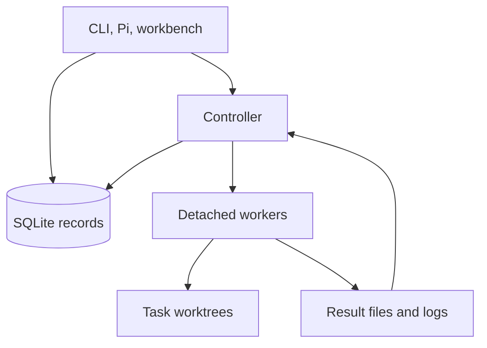

# System overview

[Visual guide](index.md) · Next: [Task execution](task-execution.md)

**The controller makes scheduling and state decisions in code. Workers perform model-assisted work.** The two have different responsibilities.

## Main parts

**In words:** the operator interfaces read or update records and can start controller activity. The controller schedules workers, collects their files, and records outcomes. Workers use isolated Git checkouts. This map shows primary relationships; it omits detailed check, review, and evidence links.

| Part | Responsibility | Source |
| --- | --- | --- |
| Operator interfaces | Submit goals; inspect progress; record decisions | [CLI](../../src/cli.ts), [Pi extension](../../.pi/extensions/mabs.ts), [workbench](../../src/workbench/server.ts) |
| Controller | Reconcile attempts, select eligible tasks, dispatch work, run checks, apply review policy | [Controller](../../src/controller/controller.ts) |
| Workers | Run Claude or Codex using a bounded context packet and a structured result format | [Adapters](../../src/adapters/harness.ts), [worker process](../../src/adapters/worker-process.ts) |
| Worktrees | Keep each task's branch and checkout separate from the base branch | [Git workspace](../../src/workspace/git.ts) |
| SQLite | Store projects, tasks, attempts, decisions, and references to evidence | [Records](../../src/store/records.ts), [schema](../../src/store/schema.sql) |
| Files | Store transcripts, completion files, check logs, review diffs, and context packets | [Paths](../../src/core/paths.ts) |

## Inside the controller

A normal tick runs these steps in order:

1. Acquire the controller lease: only one controller generation owns dispatch.
2. Reconcile existing attempts, including completed or missing workers.
3. Resume reviews waiting for capacity.
4. Promote eligible queued tasks to `READY`.
5. Dispatch work within project, provider, and machine limits.
6. Record controller health.

A tick does not wait for all newly launched workers to finish. Later ticks collect their results. The default polling interval is two seconds.

Routing uses a versioned policy, project overrides, and any explicit operator override. Context packets include requirements, the latest checkpoint, and selected files within a token budget. See the [routing policy](../routing-policy-v1.md) and [context builder](../../src/context/packet.ts).

## Boundaries to remember

- **A worktree is not a security sandbox.** Workers and project checks run local commands with local permissions.
- **Worker completion is a file, not a worker database write.** The controller collects that file and updates SQLite.
- **A model's “completed” result is not enough.** The controller validates it, checks allowed file scope, and runs the required quality/review path.
- **The base branch is not advanced.** A task's result stays on its local branch until you separately integrate it.
- **The workbench binds to localhost.** Mutation requests require its capability token; opening the UI is not an authorization to publish anything.

For data locations, see [Where things live](../getting-started.md#where-things-live). For interruptions, see [controller recovery](recovery-and-failures.md#controller-restart).
