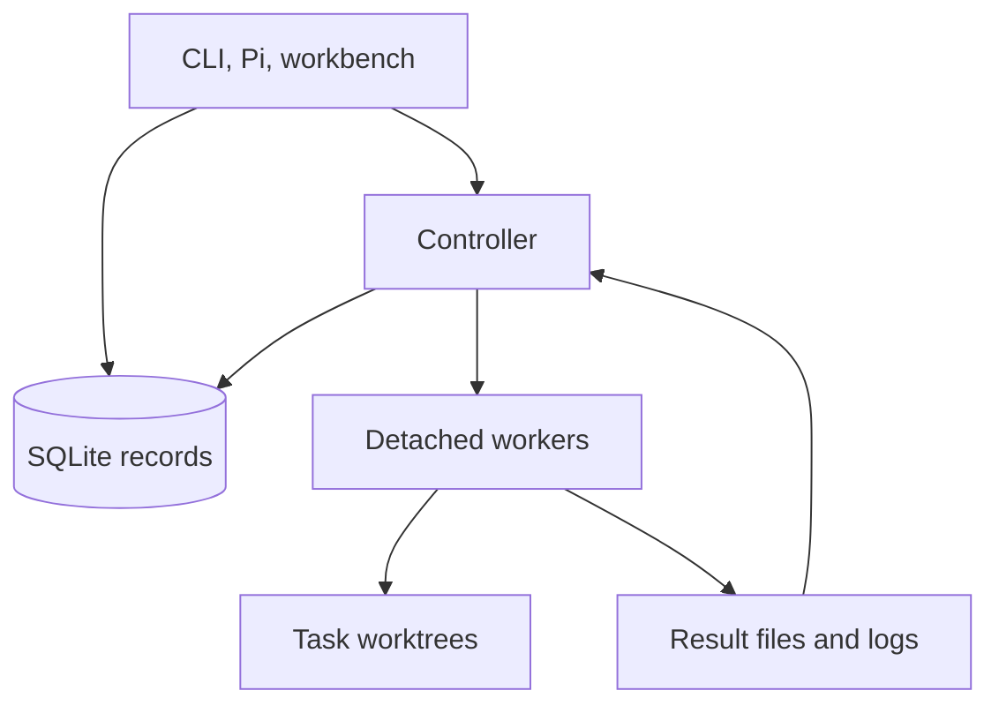

# System overview

[Visual guide](index.md) · Next: [Task execution](task-execution.md)

**The controller makes scheduling and state decisions in code. Workers perform model-assisted work.** The two have different responsibilities.

## Main parts

```mermaid
flowchart TB
    UI["CLI, Pi, workbench"] --> CTRL["Controller"]
    UI --> DB[("SQLite records")]
    CTRL --> DB
    CTRL --> WORK["Detached workers"]
    WORK --> WT["Task worktrees"]
    WORK --> FILES["Result files and logs"]
    FILES --> CTRL
```

**In words:** the operator interfaces read or update records and can start controller activity. The controller schedules workers, collects their files, and records outcomes. Workers use isolated Git checkouts. This map shows primary relationships; it omits detailed check, review, and evidence links.

| Part | Responsibility | Source |
| --- | --- | --- |
| Operator interfaces | Submit goals; inspect progress; record decisions | [CLI](../../src/cli.ts), [Pi extension](../../.pi/extensions/mabs.ts), [workbench](../../src/workbench/server.ts) |
| Controller | Reconcile attempts, select eligible tasks, dispatch work, run checks, apply review policy | [Controller](../../src/controller/controller.ts) |
| Workers | Run Claude or Codex using a bounded context packet and a structured result format | [Adapters](../../src/adapters/harness.ts), [worker process](../../src/adapters/worker-process.ts), [check tool](../../src/worker-tools/checks-mcp.ts) |
| Admission | One authority for every cap: initial work, repairs, reroutes, reviews, and checks | [Admission](../../src/scheduling/admission.ts) |
| Worktrees | Keep each task's branch and checkout separate from the base branch | [Git workspace](../../src/workspace/git.ts) |
| SQLite | Store projects, tasks, attempts, decisions, and references to evidence | [Records](../../src/store/records.ts), [schema](../../src/store/schema.sql) |
| Files | Store transcripts, completion files, check logs, review diffs, and context packets | [Paths](../../src/core/paths.ts) |

## Inside the controller

A normal tick runs these steps in order:

1. Re-read the capability registry if a new entitlement proof was recorded, and stand down while `maintenance migrate` holds the database.
2. Acquire the controller lease: only one controller generation owns dispatch.
3. Reconcile existing attempts, including completed or missing workers.
4. Collect finished check jobs. Checks run as detached stages, so a long test suite does not block the loop.
5. Observe machine pressure (and, with `--adaptive`, adjust the model-worker target).
6. Resume in-flight work first: work parked as `Admission pending:`, then reviews waiting for capacity.
7. Promote eligible queued tasks to `READY`, and block dependents of a failed or stuck prerequisite.
8. Dispatch work through one admission authority, which applies the worker, project, provider, check, and machine limits.
9. Record controller health and flush optional telemetry export (export never delays or fails a tick).

A tick does not wait for all newly launched workers to finish. Later ticks collect their results. The default polling interval is two seconds.

Routing uses a versioned policy, filtered by a versioned capability registry, plus project overrides and any explicit operator override. Context packets include requirements, the latest checkpoint, open review obligations, and selected files within a budget for the complete prompt. Workers receive the packet as compact JSON, with paths relative to roots stated once; the stored packet keeps the full record. See the [routing policy](../routing-policy-v1.md) and [context builder](../../src/context/packet.ts).

### What a worker can do

- **Run the project's checks.** Claude workers get exactly one extra tool, `mcp__mabs__run_checks`, from a local MCP server ([`checks-mcp.ts`](../../src/worker-tools/checks-mcp.ts)). It runs only the project's registered check commands, never a shell or a command the worker supplies. Every call is logged beside the attempt's evidence. Codex workers, whose sandbox can already run commands, are given the exact commands. Reviewers get neither; they read the controller's check evidence. The controller's own check run remains the authoritative result.
- **Resume for a repair.** A repair on the same provider, model, and effort continues the implementer's session with a short brief, when the session is under an hour old and the worktree is still at that attempt's result. Claude forks the session (`--resume --fork-session`), so the earlier transcript is never altered. If a resume fails before any model output, the same attempt reruns cold from the full packet.
- **Not delegate.** Native child agents are switched off on every route.

Before any launch, MABS verifies the subscription login, removes paid-API environment settings, ignores ambient user configuration, and refuses to launch if system-managed Claude or Codex settings could redirect the provider, credential, endpoint, or model.

## Boundaries to remember

- **A worktree is not a security sandbox.** Workers and project checks run local commands with local permissions.
- **Worker completion is a file, not a worker database write.** The controller collects that file and updates SQLite.
- **A model's “completed” result is not enough.** The controller validates it, checks allowed file scope, and runs the required quality/review path.
- **The base branch is not advanced.** A task's result stays on its local branch until you separately integrate it.
- **The workbench binds to localhost.** Mutation requests require its capability token; opening the UI is not an authorization to publish anything.

For data locations, see [Where things live](../getting-started.md#where-things-live). For interruptions, see [controller recovery](recovery-and-failures.md#controller-restart).
