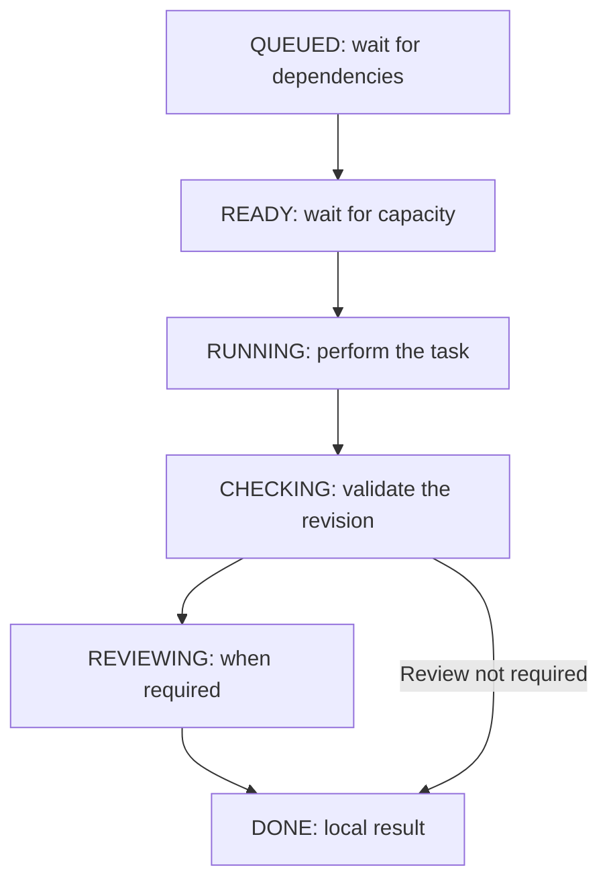
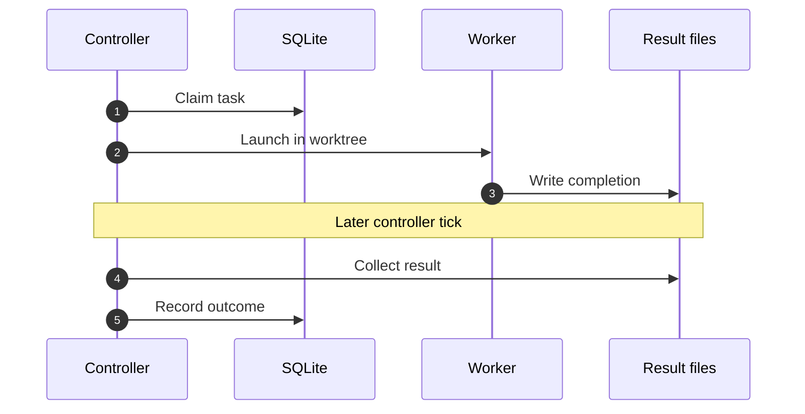
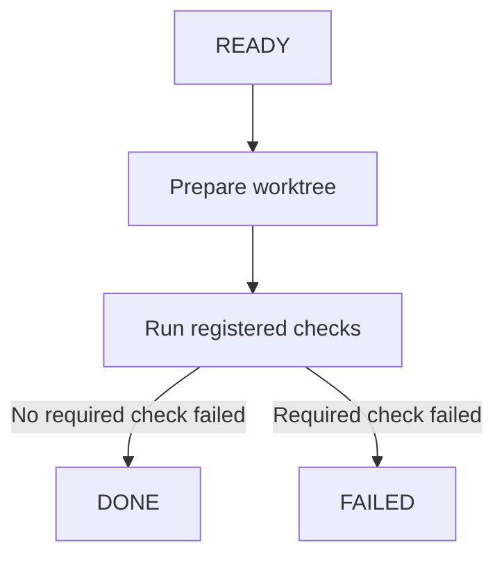

# Task execution

[Visual guide](index.md) · Previous: [System overview](system-overview.md) · Next: [Recovery and failures](recovery-and-failures.md)

**A task is the goal. An attempt is one worker run toward that goal.** Repairs and reviews can create more attempts without creating another task.

## Successful model task

**In words:** an active project's task becomes ready after its dependencies finish. Capacity and route availability determine when it runs. A valid, in-scope result is committed to the task branch, checked, and reviewed if policy requires it. Failures take [separate paths](recovery-and-failures.md).

| Stage | What matters |
| --- | --- |
| Submit | State the objective, acceptance criteria, allowed files, and dependency IDs. |
| Become ready | Dependencies must be `DONE`; the project must be active. |
| Run | Claim the task once, prepare its worktree, integrate dependency revisions, and launch the chosen route. |
| Check | Validate the result format and edit scope. Bind checks to the resulting Git revision. |
| Review | Use fresh review context and the resolved project policy. Required review cannot silently disappear when capacity is unavailable. |
| Finish | Keep the result revision and evidence. `DONE` does not mean merged, released, or deployed. |

**Quality caveat:** no required checks produces `not_configured` coverage, not passing test evidence. Some policies allow completion with that limitation. Inspect quality coverage as well as the task state; do not treat `DONE` alone as proof that tests ran.

## Worker launch and collection

This sequence spans multiple ticks. It deliberately leaves checks and review to the stage view above.

**In words:** record ownership before dispatch, launch one worker, and collect its completion file later. The worker wrapper writes the completion file atomically. The controller—not the worker—updates the task records.

## Mechanical task

**In words:** mechanical tasks run registered commands without a model attempt or AI repair loop. They still use a task worktree and revision-bound check records. No required checks still means missing coverage, even if the task reaches `DONE`. Infrastructure errors can block execution.

## Where review fits

Review depends on the resolved policy, task class, change risk, changed files, and any manual request. Fresh context is separate from the implementation conversation. The router prefers a different provider when requested by policy, but may use a fresh review context on the same provider when no second eligible provider is available.

Blocking findings return work for a bounded repair. Advisory findings do not become blocking merely because they exist. A reviewer that changes the checked workspace triggers a contract failure.

**Sources:** [Controller](../../src/controller/controller.ts) · [Worker completion](../../src/adapters/worker-process.ts) · [Quality coverage](../../src/gates/runner.ts) · [Review policy](../../src/review/policy.ts)
