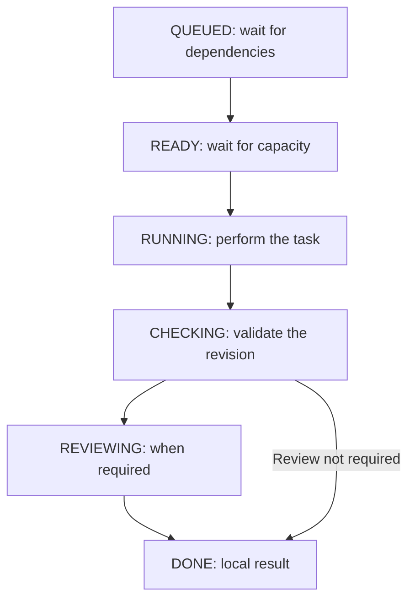
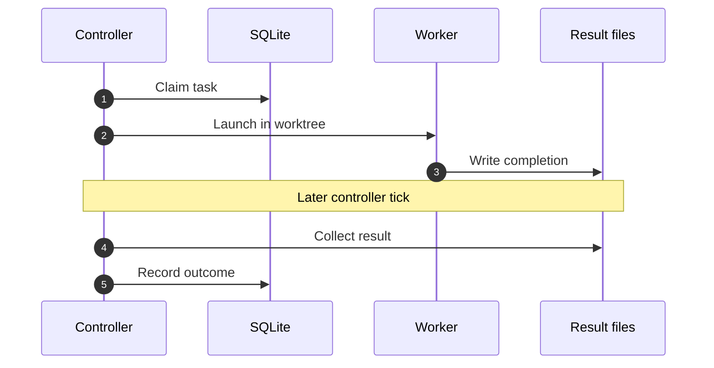
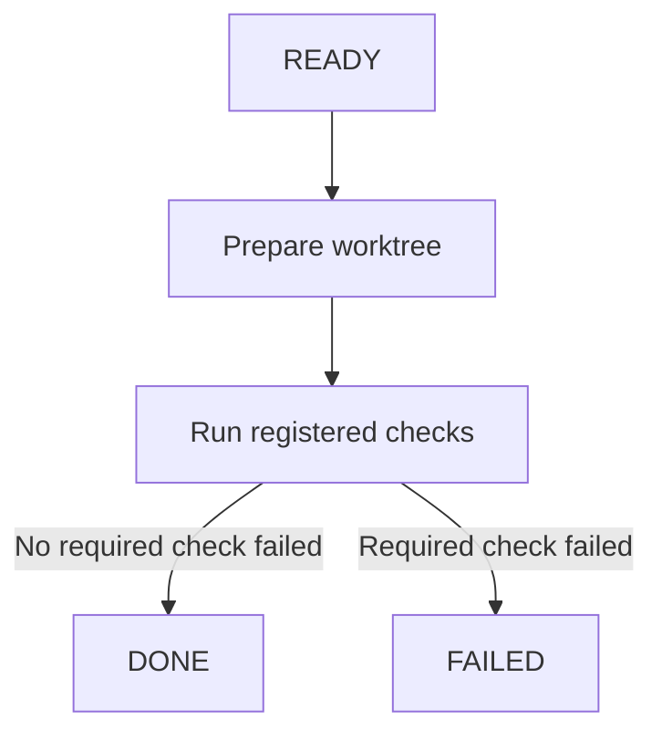

# Task execution

[Visual guide](index.md) · Previous: [System overview](system-overview.md) · Next: [Recovery and failures](recovery-and-failures.md)

**A task is the goal. An attempt is one worker run toward that goal.** Repairs and reviews can create more attempts without creating another task.

## Successful model task

```mermaid
flowchart TB
    Q["QUEUED: wait for dependencies"] --> R["READY: wait for capacity"]
    R --> W["RUNNING: perform the task"]
    W --> C["CHECKING: validate the revision"]
    C --> V["REVIEWING: when required"]
    V --> D["DONE: local result"]
    C -->|"Review not required"| D
```

**In words:** an active project's task becomes ready after its dependencies finish. Capacity and route availability determine when it runs. A valid, in-scope result is committed to the task branch, checked, and reviewed if policy requires it. Failures take [separate paths](recovery-and-failures.md).

| Stage | What matters |
| --- | --- |
| Submit | State the objective, acceptance criteria, allowed files, and dependency IDs. |
| Become ready | Dependencies must be `DONE`; the project must be active and its governance answered (type and delivery). A failed, cancelled, or stuck prerequisite blocks its dependents, with the reason, instead of leaving them silently `QUEUED`. |
| Run | Claim the task once, prepare its worktree, integrate dependency revisions, and launch the chosen route. If the project requires independent review and no other provider could ever review it, the task blocks with `CONFIG` here, before any implementation is paid for. |
| Check | Validate the result format and edit scope. Bind checks to the resulting Git revision. Checks run as detached jobs under their own concurrency cap (`--gate-limit`). |
| Review | Use fresh review context and the resolved project policy. Required review cannot silently disappear when capacity is unavailable. |
| Finish | Keep the result revision and evidence. `DONE` does not mean merged, released, or deployed. |

**Quality caveat:** no required checks produces `not_configured` coverage, not passing test evidence. Some policies allow completion with that limitation. Inspect quality coverage as well as the task state; do not treat `DONE` alone as proof that tests ran.

## Worker launch and collection

This sequence spans multiple ticks. It deliberately leaves checks and review to the stage view above.

```mermaid
sequenceDiagram
    autonumber
    participant C as Controller
    participant D as SQLite
    participant W as Worker
    participant F as Result files
    C->>D: Claim task
    C->>W: Launch in worktree
    W->>F: Write completion
    Note over C,F: Later controller tick
    C->>F: Collect result
    C->>D: Record outcome
```

**In words:** record ownership before dispatch, launch one worker, and collect its completion file later. The worker wrapper writes the completion file atomically. The controller—not the worker—updates the task records.

## Mechanical task

```mermaid
flowchart TB
    R["READY"] --> W["Prepare worktree"]
    W --> C["Run registered checks"]
    C -->|"No required check failed"| D["DONE"]
    C -->|"Required check failed"| F["FAILED"]
```

**In words:** mechanical tasks run registered commands without a model attempt or AI repair loop. They still use a task worktree and revision-bound check records. No required checks still means missing coverage, even if the task reaches `DONE`. Infrastructure errors can block execution.

## Where review fits

The project's **delivery mode** sets the review trigger:

| Delivery | Review | Behavior |
| --- | --- | --- |
| `fast` | `off` | Checks only |
| `standard` | `risk` | Review when the change risk, task class, or changed files call for it, or on a manual request |
| `verified` | `required` | Independent review always; the task blocks rather than finishing unreviewed |

A `client` project defaults to `required`. Review always runs in fresh context, separate from the implementation conversation. Whenever review runs (`standard` or `verified`), the reviewer must be on a **different provider** from the implementer, and MABS never substitutes a same-provider review. With no second eligible provider, `standard` waits (`Review pending:`) and `verified` blocks. Only an explicit custom review policy with `reviewerRoute: same_provider_fresh_context` reviews on the same provider, in a fresh session.

**One right-sized reviewer per stage.** A small change (mechanical or small implementation, not high-risk, not highly complex) is reviewed at medium effort if the reviewer's route supports it. An explicit project review route is never overridden. After a repair, the re-review checks the open findings against the *repair delta* and looks for new defects in it, consulting the whole diff only where the delta touches it. If the reviewed context drifted, the full change is reviewed again.

**Findings become obligations.** Each blocking finding or decision is stored as a durable obligation (`obligation list TASK_ID`), which repairs and re-reviews resolve by ID. A decision only a person can make waits for `obligation decide`, and resuming after it is a separate `task retry`. Blocking findings return work for a bounded repair. Advisory findings do not become blocking merely because they exist. A reviewer that changes the checked workspace triggers a contract failure.

If review was blocked for lack of a reviewer, retrying the task resumes at review. It does not re-implement the finished, checked revision.

`task scorecard TASK_ID` labels a not-required review as *not required* rather than as an approval, and reports quality coverage and usage.

**Sources:** [Controller](../../src/controller/controller.ts) · [Worker completion](../../src/adapters/worker-process.ts) · [Quality coverage](../../src/gates/runner.ts) · [Review policy](../../src/review/policy.ts)
